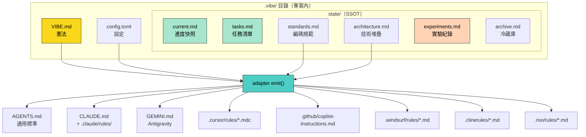
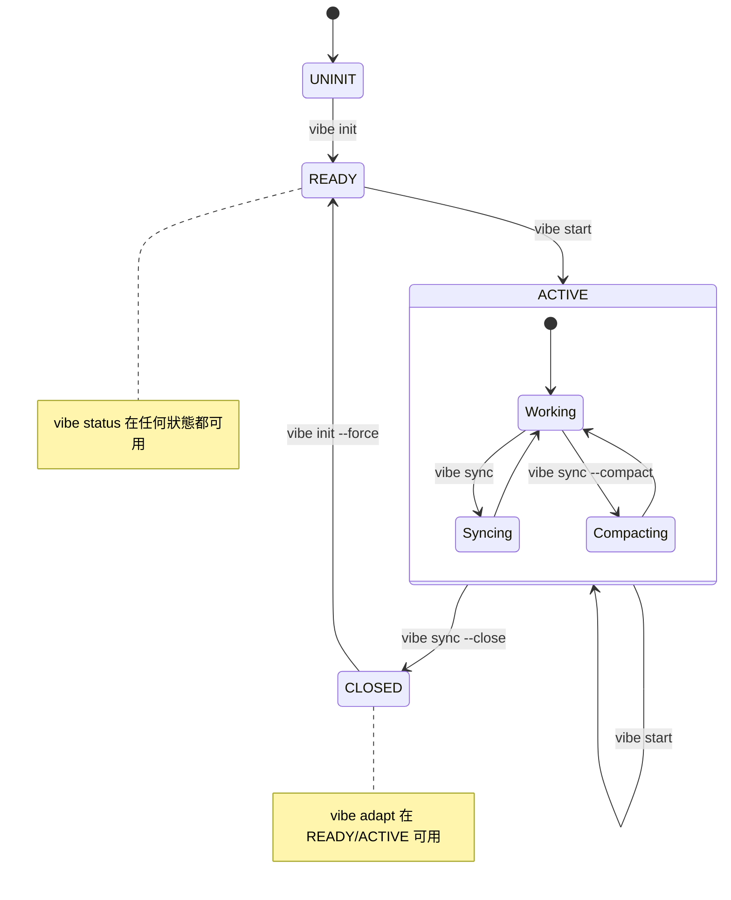
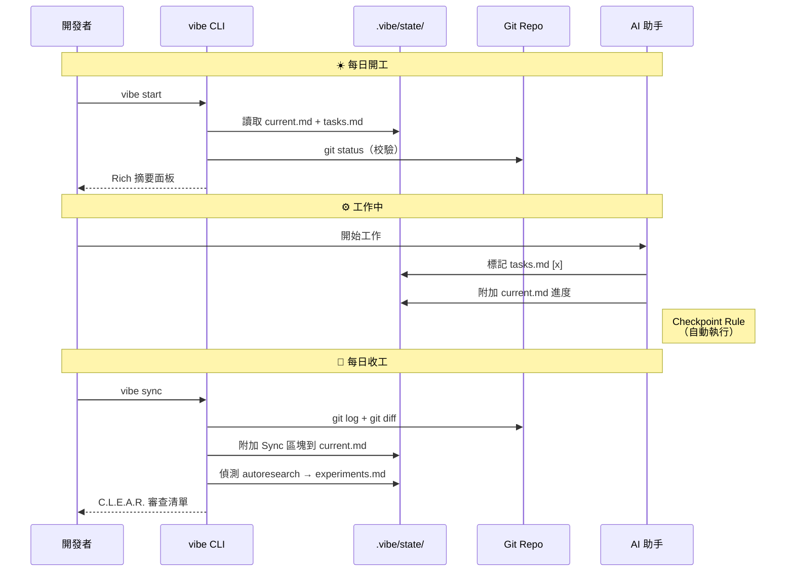
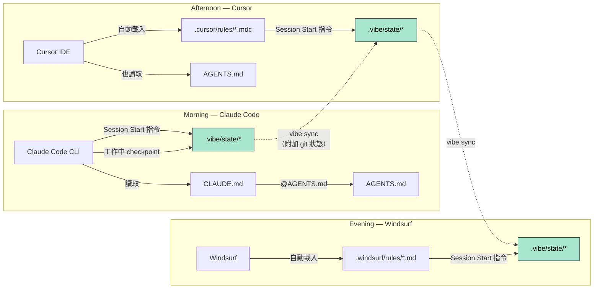
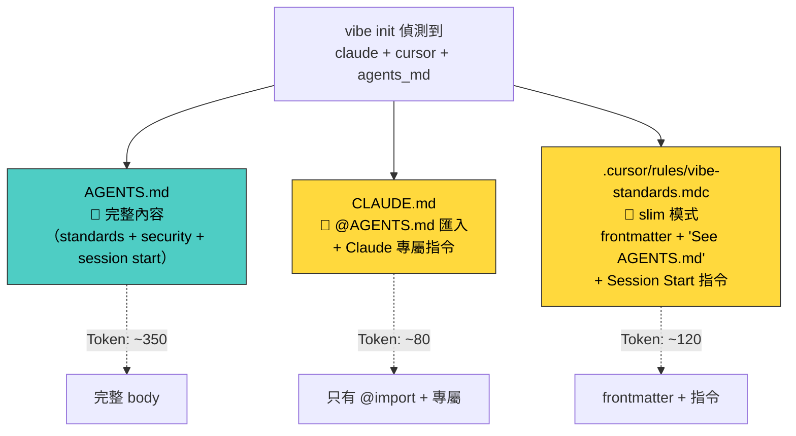
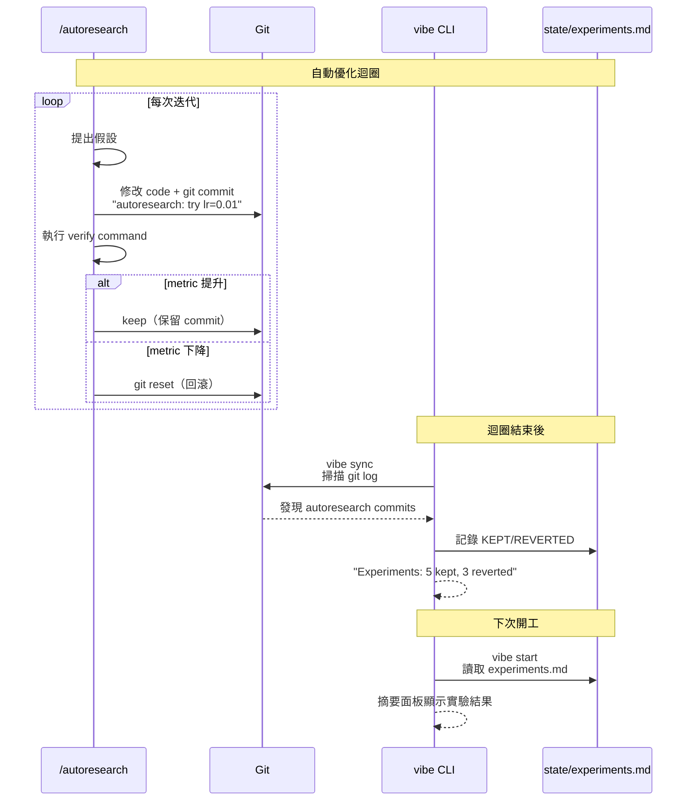

# vibe-state-cli 架構圖集

> 使用 Mermaid 語法。可在 GitHub、Notion、Obsidian、mkdocs-material 直接渲染。

---

## 圖 1：核心架構 — .vibe/ 目錄與 Adapter 衍生



---

## 圖 2：生命週期狀態機



---

## 圖 3：每日工作流



---

## 圖 4：多 Agent 切換流程



---

## 圖 5：Adapter 去重策略



---

## 圖 6：Autoresearch 整合



---

## 圖 7：安全防護層

```mermaid
flowchart TB
    INPUT["使用者輸入 / 專案中繼資料"]

    INPUT --> SANITIZE["_sanitize()<br/>過濾 \\n # \" ' \`"]
    SANITIZE --> TEMPLATE["Jinja2 模板渲染"]
    TEMPLATE --> VALIDATE["adapter.validate()<br/>檢查 frontmatter"]
    VALIDATE --> WRITE["原子寫入<br/>temp + os.replace()"]
    WRITE --> SNAPSHOT["save_snapshot()<br/>快照存檔"]

    subgraph "刪除防護"
        REMOVE["vibe adapt --remove"]
        REMOVE --> DRYRUN{"--dry-run?"}
        DRYRUN -->|是| PREVIEW["預覽不執行"]
        DRYRUN -->|否| CONFIRM{"--confirm?"}
        CONFIRM -->|否| WARN["顯示警告<br/>偵測用戶修改"]
        CONFIRM -->|是| BACKUP["create_backup()<br/>保留 3 份"]
        BACKUP --> DELETE["刪除檔案"]
    end

    subgraph "狀態防護"
        LIFECYCLE[".lifecycle 狀態機"]
        LIFECYCLE --> CHECK["每個指令先驗轉換"]
        CHECK -->|無效| ERROR["報錯 + 列出合法指令"]
        CHECK -->|有效| EXECUTE["執行"]
        PATHVAL["_validate_filename()"] --> PATHCHECK{"在 state/ 內?"}
        PATHCHECK -->|否| REJECT["拒絕（路徑穿越）"]
        PATHCHECK -->|是| PROCEED["允許"]
    end

    style SANITIZE fill:#ff6b6b,stroke:#333,color:#fff
    style VALIDATE fill:#ff6b6b,stroke:#333,color:#fff
    style BACKUP fill:#4ecdc4,stroke:#333,color:#000
    style LIFECYCLE fill:#ffd93d,stroke:#333,color:#000
```
